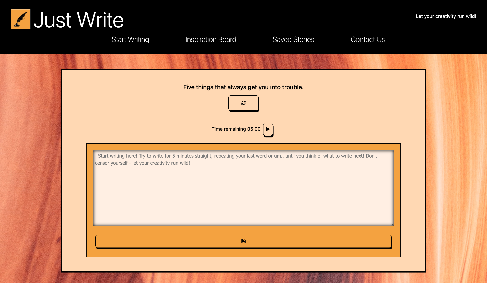

# Free-Writing-App

## Purpose
An app to help users get past their writer's block.

## User Story
AS A writer,
* I WANT to be inspired with random prompts,
* SO THAT I can get past creative writer’s block.

## Acceptance Criteria
GIVEN I am using a journal with prompts for creative writing
* WHEN I open the journal
* THEN I am presented with a prompt and an area to write in
* WHEN I hit a refresh button
* THEN I get a new prompt
* WHEN I hit save button
* THEN my journal entry is saved in localstorage
* WHEN I scroll down
* THEN I am presented with an inspiration board that searches by a keyword
* WHEN I scroll down
* THEN I see my past saved entries with the according date and prompt shown with it

## Built with
* HTML
* CSS
* JavaScript
* Bootstrap & Fontawesome
* Pexels API
* Word API

## Website

https://heatherjswift.github.io/Just-Write/

## Screenshot

## Future Development
*	Different length timers 5, 10, 15
*	Recommended playlists based on types of writing, mysteries, fantasy, sci-fi, post-apocalyptic, school project
*	Separate page linked in nav with all past entries that tells you the prompt you had at the time of writing, how long you wrote for that session, word count.
*	When you complete a prompt and save the app will give you a compliment and cheer you on
*	If you keep hitting refresh it asks you if you’re still stuck and refers you to the inspiration board
*	To monetize if they want the option to save it asks them to watch a short ad
*	Some kind of xp gain system with achievements for using the app.
*	Create user accounts
*	Top stories
*	Users can vote on stories
*	Users can search their prompt to see what other people have come up with

## References
Pexels API build: KodAktif video Egitim, youtube video https://www.youtube.com/watch?v=1OZPeoylatM

## Created By
Group 3: Ulemjin Badral, Kyle Barrer, Samia Ferdous and Heather Swift.    
